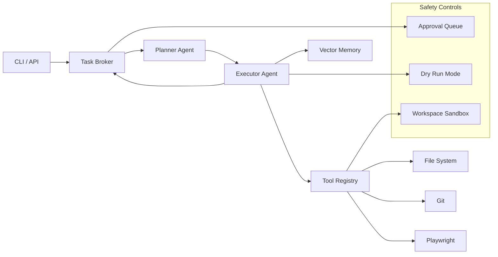

# xander-operator — AI Automation Engine

Modular AI system that automates real-world tasks: web browsing, research, form filling, and more.

[](https://github.com/GBOYEE/xander-operator/actions)
[](LICENSE)

## 🚀 What Problem This Solves

Manual research, form filling, and repetitive web tasks consume hours. Existing automation tools are brittle and require constant maintenance. You need an AI system that can understand tasks, browse intelligently, and execute reliably with memory.

## ⚙️ How It Works

Xander-operator combines:
- **Playwright** for stable, headless browser interaction (browse, fill, click)
- **LLM orchestration** (OpenAI/Ollama) for reasoning and decision-making
- **Vector memory** (Chroma/FAISS) for contextual awareness across tasks
- **Human approval gates** before sensitive actions
- **Structured logging** and HTML reporting

Tasks are defined as JSON workflows. The agent executes steps sequentially, using the browser tool to navigate and extract data, the LLM to interpret and decide, and memory to remember context. Outputs include rich JSON logs and HTML reports.

## 📈 Why It Matters

- **Reusable primitives**: Not a one-off script — designed as building blocks for larger agent systems
- **Production-ready**: Error handling, retries, timeouts, and observability baked in
- **Fast local dev**: Runs with `--no-sandbox` for CI; uses Playwright's battle-tested automation
- **Extensible**: Add custom tools and workflows without touching core

Result: An automation engine you can trust for real-world tasks.

---

## 🏗️ Architecture


**Components:**
- **Task Broker** — queues tasks, tracks status, persists results
- **Planner Agent** — GSD planner: decomposes task into steps, selects tools
- **Executor Agent** — runs steps, calls tools, updates memory
- **Tool Registry** — browse, fill, code, reason (each with permission model)
- **Vector Memory** — Chroma/FAISS storage for context retrieval across sessions
- **Safety Layer** — dry‑run, approval workflows, workspace confinement

## 🚀 Quick Start
```bash
# Install
pip install -e .

# Run agent (CLI)
xander-operator --task "Add authentication middleware to FastAPI app"

# Or start API server
uvicorn xander_operator.api.server:app --reload
# POST /run with {"task": "..."}

# Set model (default: phi3:mini for local speed)
export XANDER_OPERATOR_MODEL=phi3:medium
```

## 🔧 Tools
| Tool | Permission | Description |
|------|------------|-------------|
| `browse` | low | Fetch web pages, extract content |
| `fill` | medium | Form automation (Playwright) |
| `code` | high | Read/write files, apply patches |
| `reason` | low | LLM reasoning without action |

Tools can be enabled/disabled via config.

## 🧠 Model Selection
- **Local (Ollama):** `phi3:mini` (fast), `phi3:medium` (balanced), `llama3.1:8b` (powerful but slow)
- **OpenAI:** `gpt-4o-mini`, `gpt-4-turbo` (set `OPENAI_API_KEY`)

Change via `XANDER_OPERATOR_MODEL` env var.

## 🔒 Safety
- **Workspace sandbox** — agent can only access `$WORKDIR` (default: `/workspace`)
- **Git rollback** — every action creates a commit; revert with `git revert`
- **Shell opt‑in** — set `XANDER_ALLOW_SHELL=true` to enable shell commands
- **Dry run mode** — set `XANDER_DRY_RUN=true` to preview changes without writing
- **Approval queue** — medium/high actions can require manual review (configurable)

## 📊 Observability
- **API health** — `GET /health` (FastAPI)
- **Task status** — `GET /tasks` lists recent tasks and their state
- **Structured logs** — JSON output for log aggregation
- **Metrics** — `GET /metrics` (Prometheus format)

## 🧪 Testing & QA
```bash
# Install pre-commit hooks
pre-commit install

# Run tests
pytest tests/ -v --cov

# Coverage target: 85%
```

## 🚢 Deployment
```bash
# Docker Compose (recommended)
docker-compose up -d

# Or systemd
sudo cp xander-operator.service /etc/systemd/system/
sudo systemctl enable --now xander-operator
```
See `docker-compose.yml` for environment variables.

## 📚 Example API Usage
```bash
curl -X POST http://localhost:8000/run \
  -H "Content-Type: application/json" \
  -d '{"task": "Fix the lint errors in src/utils.py"}'
```

Response:
```json
{
  "task_id": "abc123",
  "status": "completed",
  "steps": [
    {"tool": "code", "description": "Fix import order", "files_changed": ["src/utils.py"]},
    {"tool": "code", "description": "Remove trailing whitespace", "files_changed": ["src/utils.py"]}
  ],
  "commit_sha": "def456",
  "summary": "Applied 2 changes; all lint errors resolved."
}
```

---

**Ready to build?** Let Xander handle the grunt work while you focus on architecture.

## 🚀 Quick Start

```bash
# Install
pip install -e .

# Run agent (CLI)
xander-operator --task "Add authentication middleware to FastAPI app"

# Or start API server
uvicorn xander_operator.api.server:app --reload
# POST /run with {"task": "..."}

# Set model (default: phi3:mini for local speed)
export XANDER_OPERATOR_MODEL=phi3:medium
```

## 🏗️ Architecture


**Components:**

- **Task Broker** — queues tasks, tracks status, persists results
- **Planner Agent** — GSD planner: decomposes task into steps, selects tools
- **Executor Agent** — runs steps, calls tools, updates memory
- **Tool Registry** — browse, fill, code, reason (each with permission model)
- **Vector Memory** — Chroma/FAISS storage for context retrieval across sessions
- **Safety Layer** — dry‑run, approval workflows, workspace confinement

## 🔧 Tools

| Tool | Permission | Description |
|------|------------|-------------|
| `browse` | low | Fetch web pages, extract content |
| `fill` | medium | Form automation (Playwright) |
| `code` | high | Read/write files, apply patches |
| `reason` | low | LLM reasoning without action |

Tools can be enabled/disabled via config.

## 🧠 Model Selection

- **Local (Ollama):** `phi3:mini` (fast), `phi3:medium` (balanced), `llama3.1:8b` (powerful but slow)
- **OpenAI:** `gpt-4o-mini`, `gpt-4-turbo` (set `OPENAI_API_KEY`)

Change via `XANDER_OPERATOR_MODEL` env var.

## 🔒 Safety

- **Workspace sandbox** — agent can only access `$WORKDIR` (default: `/workspace`)
- **Git rollback** — every action creates a commit; revert with `git revert`
- **Shell opt‑in** — set `XANDER_ALLOW_SHELL=true` to enable shell commands
- **Dry run mode** — set `XANDER_DRY_RUN=true` to preview changes without writing
- **Approval queue** — medium/high actions can require manual review (configurable)

## 📊 Observability

- **API health** — `GET /health` (FastAPI)
- **Task status** — `GET /tasks` lists recent tasks and their state
- **Structured logs** — JSON output for log aggregation
- **Metrics** — `GET /metrics` (Prometheus format)

## 🧪 Testing & QA

```bash
# Install pre-commit hooks
pre-commit install

# Run tests
pytest tests/ -v --cov

# Coverage target: 85%
```

## 🚢 Deployment

```bash
# Docker Compose (recommended)
docker-compose up -d

# Or systemd
sudo cp xander-operator.service /etc/systemd/system/
sudo systemctl enable --now xander-operator
```

See `docker-compose.yml` for environment variables.

## 📚 Example API Usage

```bash
curl -X POST http://localhost:8000/run \\
  -H "Content-Type: application/json" \\
  -d '{"task": "Fix the lint errors in src/utils.py"}'
```

Response:

```json
{
  "task_id": "abc123",
  "status": "completed",
  "steps": [
    {"tool": "code", "description": "Fix import order", "files_changed": ["src/utils.py"]},
    {"tool": "code", "description": "Remove trailing whitespace", "files_changed": ["src/utils.py"]}
  ],
  "commit_sha": "def456",
  "summary": "Applied 2 changes; all lint errors resolved."
}
```

---

**Ready to build?** Let Xander handle the grunt work while you focus on architecture.
