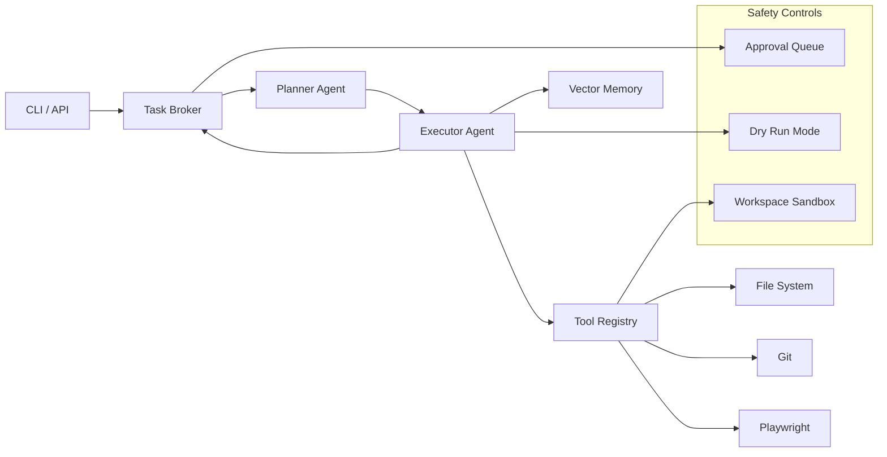

# xander-operator — AI Automation Engine

[](LICENSE)
[](https://www.python.org)
[](docker-compose.yml)
[](https://github.com/GBOYEE/xander-operator/actions)
[](https://codecov.io/gh/GBOYEE/xander-operator)

**Reusable AI primitives for automating real-world tasks.** xander-operator provides browser automation, research, and task execution with human approval gates, vector memory, and structured reporting.

<p align="center">
  
</p>

## ✨ Features

- 🤖 **Browser Automation** — Playwright-powered navigation, form filling, data extraction
- 🧠 **LLM Reasoning** — Integrates with OpenAI or Ollama for decision-making
- 💾 **Vector Memory** — Context awareness across long-running tasks (Chroma/FAISS)
- ✅ **Human Approval Gates** — Safety checks before sensitive actions
- 📊 **HTML Reports** — Rich, shareable reports with screenshots and logs
- 🐳 **Docker Ready** — Run headless in CI or production

## 🚀 Quick Start

```bash
git clone https://github.com/GBOYEE/xander-operator.git
cd xander-operator
pip install -e .
xander-operator --task "Summarize the latest news about AI"
```

Or as an API server:
```bash
uvicorn xander_operator.api.server:app --reload
# POST /run with {"task": "..."}
```

## 🏗️ Architecture



See [docs/architecture.md](docs/architecture.md) for component details.

## 📦 Tech Stack

| Layer | Technology |
|-------|------------|
| Orchestration | Custom agent runtime (GSD planning) |
| LLM | OpenAI, Anthropic, Ollama (via OpenRouter) |
| Memory | Chroma / FAISS |
| Browser | Playwright (headless) |
| API | FastAPI |
| Storage | SQLite (state) + file system |
| DevOps | Docker, pre-commit hooks, CI |

## 🧪 Testing & CI

```bash
pytest tests/ -v --cov=xander_operator
```

CI runs on every push: `black`, `ruff`, `mypy`, tests, coverage.

## 📚 Documentation

- [Getting Started](docs/README.md)
- [API Reference](docs/api.md)
- [Tools Catalog](docs/tools.md)
- [Contributing](CONTRIBUTING.md)

## 🎯 Roadmap

- [ ] MCP (Model Context Protocol) integration
- [ ] Multi-agent teams (orchestrate multiple xander-operator instances)
- [ ] Cloud browser provider (Browserless, Zyte)
- [ ] Distributed memory cluster
- [ ] Plugin marketplace

## 🤝 Contributing

See [CONTRIBUTING.md](CONTRIBUTING.md). We especially need help with:
- Additional browser tools (PDF parsing, captcha solving)
- Memory backends (Pinecone, Weaviate integrations)
- Better report templates

## 📄 License

MIT — see [LICENSE](LICENSE).

---

<p align="center">
Built by <a href="https://github.com/GBOYEE">Oyebanji Adegboyega</a> • 
<a href="https://gboyee.github.io">Portfolio</a> • 
<a href="https://twitter.com/Gboyee_0">@Gboyee_0</a>
</p>
